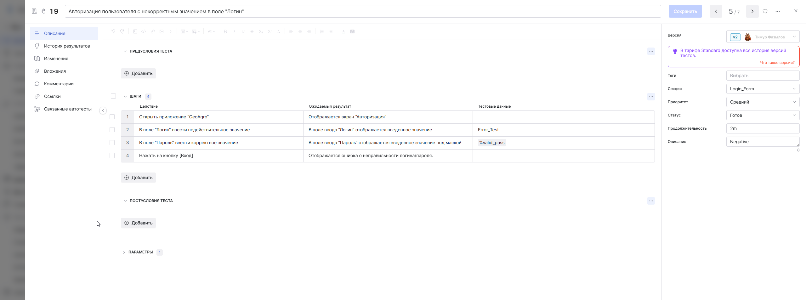
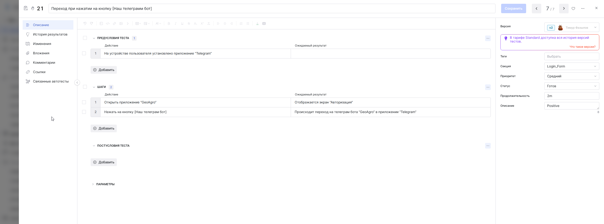
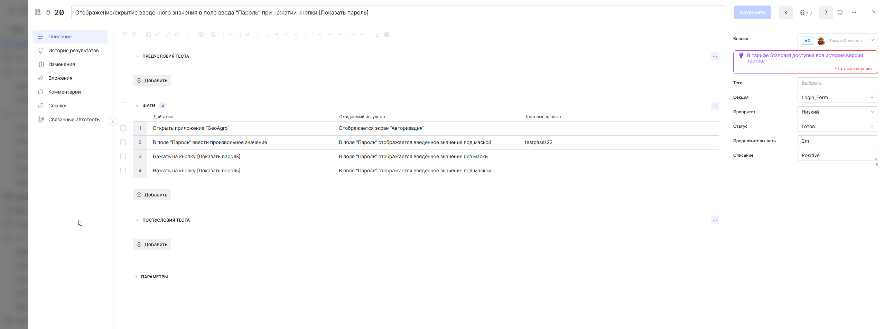
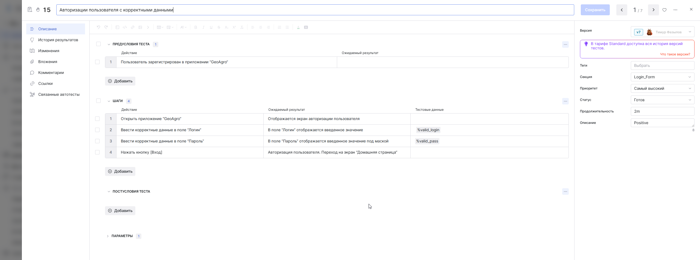
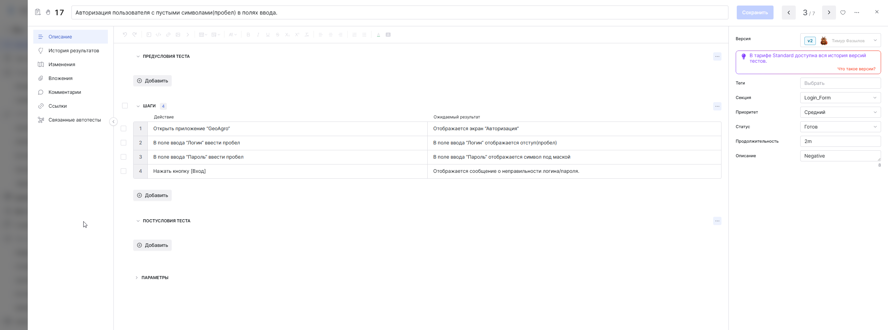
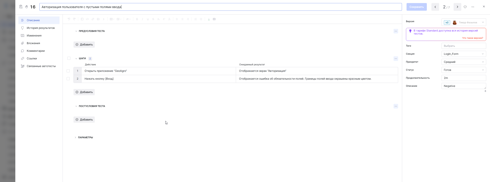
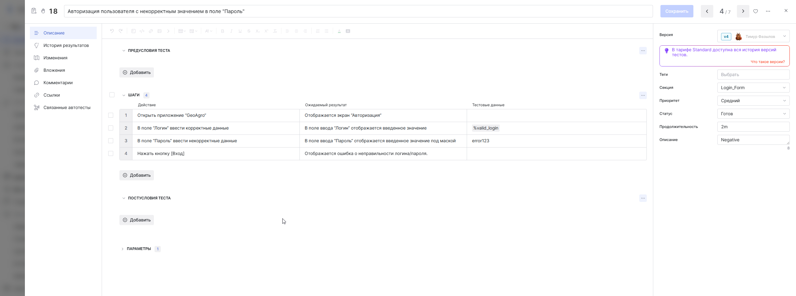

<h1 align="center">
  👋 Привет! Меня зовут Тимур.
</h1>
<h3 align="center">
  Инженер по обеспечению качества (QA).
</h3>

  <a href="https://t.me/sidemap">Telegram</a> 

---

### 🧑‍💻 Обо мне

Специалист по ручному тестированию (Web, Mobile) на начальном этапе карьеры с опытом работы по ключевым направлениям.

Организация работы: ведение документации, соблюдение сроков и прозрачная коммуникация с командой.

**Моя цель:** развитие в области Quality Assurance в окружении сильной команды.

---

### 🎓 Образование

**Санкт-Петербургский государственный лесотехнический университет им. С.М. Кирова** 
 **Инфокоммуникационные системы и технологии**  
2023 · Бакалавр

---

### 🛠️ СТЕК

Технологии и инструменты, которые я использую в своей работе:

| Категория | Инструменты |
| :--- | :--- |
| **Тест-менеджмент & Баг-трекинг** |   |
| **Тестирование API** |   |
| **Тестирование Веб & Мобильных приложений** |    |
| **Базы данных & Системы контроля версий** |     |
| **Языки & Форматы** |      |
---

### 📸 Примеры тест-кейсов

  
  

  
  

  
  

  

### 📁 Портфолио

| Название | Описание | Технологии | Ссылка |
| :--- | :--- | :--- | :--- |
| **Документация** | Примеры тестовой документации. | `Test IT` `Excel` | [check-list](https://raw.githubusercontent.com/Deadline37/Deadline37/main/Doc_Example/check_list(1).xlsx)   [report](https://raw.githubusercontent.com/Deadline37/Deadline37/main/Doc_Example/Bug_Report_Capital_com_exact_v2.xlsx) |
| **Коллекция Postman** | Часть коллекции запросов для тестирования и проверки API. Используется командой. | `Postman` | [Экспорт →](https://www.postman.com/speeding-satellite-290820/workspace/geo-agro/collection/38478114-eeecadbf-1286-4da3-a541-7f828fb67b84?action=share&creator=38478114) |

---

   
  Последнее обновление: январь 2026

